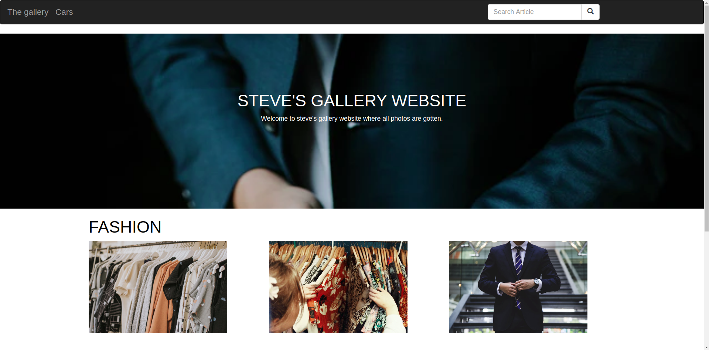

## Project Name
- Steve Gallery
## Project Description
- The website basically displays all the images that have been add to the website through the admin side hence displaying the on the userinterface.
## BDD
 
 
## AUTHOR'S OF THE PROJECT
- kebaso steve ongati
## TECHNOLOGY USED
- Bootstrap
- Django
- css and bootstrap
- Html
- Database
- python

## SETUP REQUIREMENTS
- Python 3.6
- Internet Connection
- Run the following commands on your terminal:
`$ git clone https://github.com/kebasoh/gallery`
- Navigate to the folder
 `$ cd <folder/file name>`
- To run the application;
 `$ python3.6 manage.py runserver`

## TESTING 
- To run the tests on the application run 
## CONTACTS 
- Email:ongatikebaso@gmail.com
- Github:Kebasoh
## KNOWN BUGS
- No known bugs, if you encounter any, feel free to contact us.
## LECENSE
- MIT Licence (c) Gallery kenya 2020